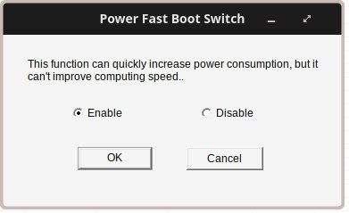
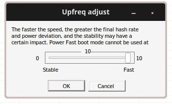
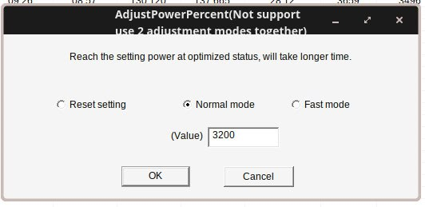
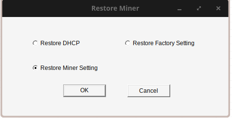

# WhatsMiner Dynamic Power Curtailment

A practical guide for implementing dynamic power adjustment on WhatsMiner ASICs without rebooting.

## Prerequisites

- WhatsMinerTool firmware version 2025xxxx or newer
- Power Fast Boot **MUST** be enabled for dynamic adjustment

## Quick Start

### 1. Enable Power Fast Boot

Navigate to Miner Config and enable **Power Fast Boot** (one-time reboot required).

### 2. Configure Upfreq Speed

Controls frequency tuning speed during startup. Choose based on your needs:

- **1-2:** Maximum efficiency, slowest tuning (base load operations)
- **5-6:** Balanced for daily curtailment (8-10 min to full hashrate)
- **8-10:** Fastest frequency ramp (~6-7 min to full hashrate), 2-3% efficiency loss

### 3. Adjust Power Dynamically

Navigate to **Adjust Power** and select between:

- **Normal Mode:** Maintains efficiency while adjusting power
- **Fast Mode:** Instant response with efficiency tradeoff (for immediate grid requirements)

Enter target wattage directly (e.g., 3700W → 3200W → 3700W). The miner adjusts without rebooting.

## Common Curtailment Scenarios

### Daily Peak Shaving (2-6pm)

- Power Fast Boot: ON
- Upfreq Speed: 5-6
- Mode: Normal
- Strategy: 60% power during peak hours

### Grid Emergency (<5 min response)

- Power Fast Boot: ON
- Upfreq Speed: 10
- Mode: Fast (if <2 min required)
- Strategy: Drop to minimum power immediately

### Solar/Renewable Integration

- Power Fast Boot: ON
- Upfreq Speed: 6-8
- Mode: Normal
- Strategy: Match generation curve

### Heat Management (Summer)

- Power Fast Boot: ON
- Upfreq Speed: 3-5
- Strategy: Reduce power with temperature rise

## Quick Reference

| Response Time | Upfreq | Mode   | Use Case           |
| ------------- | ------ | ------ | ------------------ |
| <2 minutes    | 10     | Fast   | Emergency only     |
| <5 minutes    | 8-10   | Normal | Grid response      |
| 10-15 minutes | 5-6    | Normal | Daily curtailment  |
| Any           | 3-5    | Normal | Weekly adjustments |

## Key Points

- **Without Power Fast Boot:** Miner drops to 0W and restarts (sudden load release)
- **With Power Fast Boot:** Smooth power transitions, no mining interruption
- **Normal Mode:** Maintains efficiency during adjustment
- **Fast Mode:** Immediate response but significant efficiency loss

## Restoring to Normal Operation

When you need to restore the miner back to tuning for best hashrate/efficiency:

1. Navigate to the **Restore Miner Setting** option
2. Click the restore button (machine will reboot)

**Important Notes:**

- This restoration process requires a full reboot
- **Tuning cache files will be cleared**, resulting in longer tuning time after reboot
- Expect extended startup time as the miner re-tunes from scratch for optimal efficiency

## API Automation

- Enable Power Fast Boot via API before dynamic adjustments
- Use absolute wattage values, not percentages

## Troubleshooting

**Miner still reboots:** Verify Power Fast Boot enabled and firmware updated

**Percentage adjustment causes reboot:** Use absolute wattage values

**No effect:** Update firmware to latest version

---

_Based on reverse-engineered firmware behavior and field testing. WhatsMiner doesn't officially document these features._
